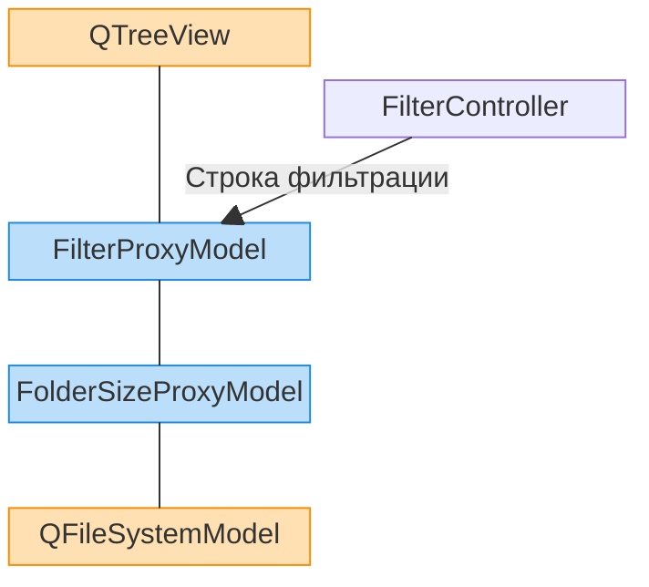

## Пояснение к тестовому заданию

Выполнены все пункты тестового задания.

Пункт 3.е реализовал через контекстное меню (ПКМ по папке -> Вычислить размер папки). Подсмотрел, как это реализовано у других файловых менеджеров и адаптировал.

### Описание версий:
- **1.0** — переход на cmake, настройка CI, начальный README.
- **1.0.1** — небольшой рефакторинг.
- **1.1** — стартовая директория - домашняя директория пользователя, отображение скрытых файлов.
- **1.1.1** - исправлено удаление устаревших .patch файлов.
- **1.2** — добавлена фильтрация файлов и папок по имени.
- **1.3** — добавлена функция вычисления размера папки.

### Структура прокси-слоев для QTreeView

- **QTreeView**: Отображение в окне файлового дерева, полученного от `FilterProxyModel`.
- **FilterProxyModel**: Фильтрация папок и файлов по имени, полученных от `FolderSizeProxy`. `FilterController` задает строку, по которой нужно фильтровать.
- **FilterController**: При обновлении строки фильтра в окне обновляет фильтр в прокси-модели.
- **FolderSizeProxy**: Отображение размера папки. Обновляет колонку после вызова функции "Вычислить размер папки" из контекстного меню. Получает файловую структуру из `QFileSystemModel`.
- **QFileSystemModel**: Стандартный класс для получения модели файловой структуры.

Почему так? Модульная структура и разделение ответственности.

### CI
Когда срабатывает:
- Добавление тега v\*.\*.\*-rc.* (релиз кандидат).
- Pull request.
- Мердж коммит в master после PR (на мастер стоит protection rules).

Что делает:
1. Собирает и проверяет линтерами (легко встроить тесты).
2. При мердже ставится тег версии без -rc.*.
3. Автоматически заполняется changelog для .deb пакета (просто копируются тексты коммитов от предыдущей версии до HEAD).
4. Генерируются .patch файлы.
5. При мердже changelog и patch файлы заливаются в master ветку.
6. Собирается .deb пакет.
7. Публикуется релиз, прикрепляется .deb пакет и архив с patch файлами.

#### Что еще хотелось бы сделать:
- CHANGELOG.md
- Кешировать сборки при CI.